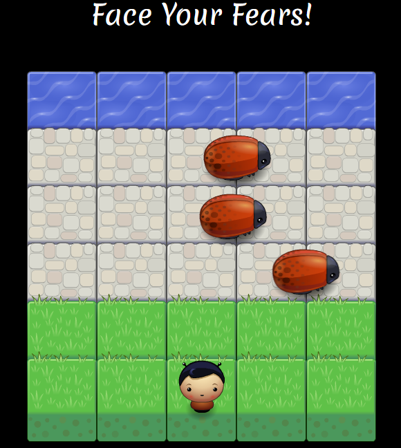

# Classic Arcade Game Project (Face Your Fears!)

## What is Face Your Fears!

A classic arcade game where the goal is to Player reaches the water without
colliding with the Enemy (bugs).
It's part of the Udacity and Google's Schoolarship Front-End Web Developer.

### Instructions

* Open https://fonsecajoao.github.io/ArcadeGame/ or you can set up a local host
  server in less than 1 min using Node.js:
    1. Download and install Node.js at https://nodejs.org/en/.
    2. Use your favorite shell and type `npm install -g http-server`.
    3. Once it finish type `http-server`.
    4. Grab the IP (http://xxx.xxx.x.x:8080) it outputs and you are done!

* Using the right, left, up, down arrow keys move the character into the water
  without colliding with bugs.

### Screenshot

### Challenge

Reach the water in only 1 try!

### External libraries Used

* Bootstrap
* jQuery
